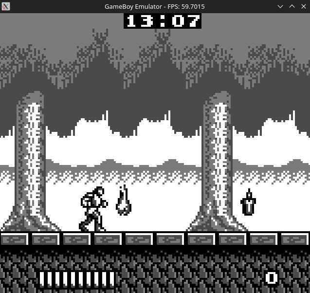
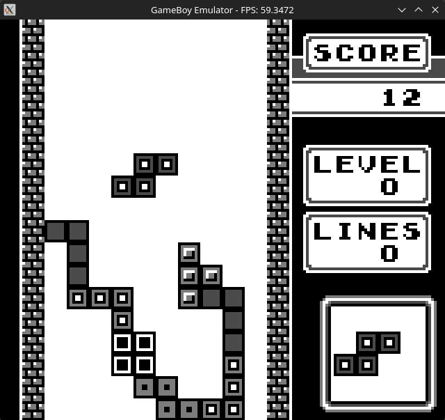
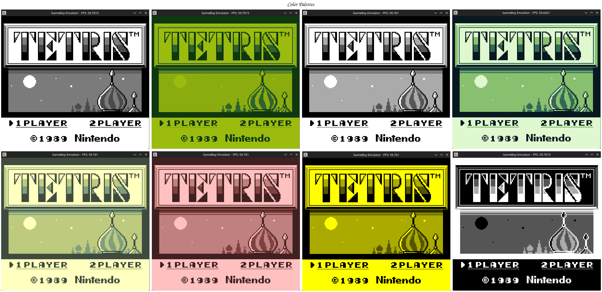

# GameBoy Emulator

A simple GameBoy emulator written in C++ using SDL3, supporting MBC0/MBC1/MBC3 cartridges

## Features
- Full SM83 CPU emulation
- PPU with background, window, and sprite rendering
- MBC0/MBC1/MBC3 cartridge support (including RTC)
- Cross-platform (Windows/Linux)
- Customizable Color Palettes
- File Explorer to Select Roms





## Missing Features (TODO)
- Sound Support
- Battery Save/Load
- Save States
- CGB Support

## Build

```
mkdir build && cd build
cmake ..
make
```

Requires SDL3.

** Controls
| Key | Action |
|-----|--------|
| Arrow Keys | D-pad |
| Z | A button |
| X | B button |
| Enter | Start |
| Backspace | Select |
| 8 | Open Rom file |
| 9/0 | Cycle color palettes |

## What I learned
Based on my interest in low-level programming and retro gaming, i wanted to make this emulator to see how a simple game console actually works and most importantly see if i can actually replicate it.
I learned a lot about CPU timing, frame buffers and rendering methods, and even how different CPU architectures handle same problems which was amazing.
I also learned so many things about the C++ language itself.
